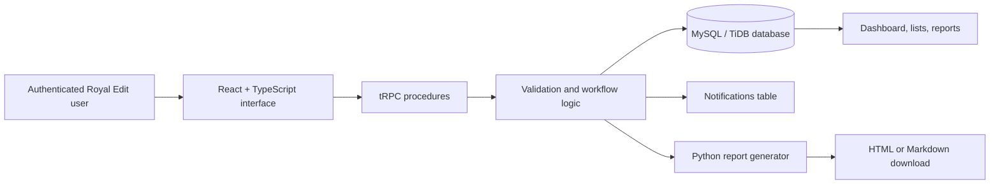

# Royal Edit Media House Operations Hub

**Prepared by:** Manus AI  
**Project type:** Internal project and team management web application  
**Version:** Prototype 1.0

## 1. What was built

The **Royal Edit Operations Hub** is a branded internal web application for organising the agency’s staff, client relationships, projects, task assignments, deadlines, notifications, and project-level reporting. The implementation is intended as a functional prototype for the Digital & Technology Lead assessment. It prioritises a coherent operational workflow rather than an oversized feature set.

The application is designed around one practical delivery sequence: a manager adds team members and clients, creates a project for a client, creates and assigns the tasks required to complete that project, updates statuses as work progresses, and generates a current project report when needed.

## 2. Problem solved

Creative and media teams often operate across fragmented messages, spreadsheets, and informal task tracking. That makes ownership difficult to see, deadlines easier to miss, and project progress harder to report. The Operations Hub creates one source of truth for essential delivery information.

| Operational problem | Prototype response |
|---|---|
| Team capacity is unclear | The Team module stores staff name, role, email, and active/inactive status. |
| Client context is disconnected from delivery work | The Clients module links every project to a client record and primary contact. |
| Project work has no consistent lifecycle | Projects have a client, description, delivery dates, and a controlled status set. |
| Task ownership may be unclear | Each task can be assigned or reassigned to a team member. |
| Assignments may be missed | An in-app notification is automatically created whenever a task is assigned or reassigned. |
| Reporting takes manual effort | The Reports module calculates delivery metrics and invokes a server-side Python generator for downloadable HTML or Markdown reports. |

## 3. Implemented modules and workflows

| Module | Implemented capability |
|---|---|
| Executive dashboard | Shows total staff, total clients, active projects, overdue tasks, and the most recent operational activity. |
| Team members | Adds, edits, views, and deactivates staff through an active/inactive status. |
| Clients | Adds, edits, and views organisations with a primary contact, email, and phone number. |
| Projects | Creates, edits, views, and updates status inline for client-linked projects. |
| Tasks | Creates, edits, views, assigns, reassigns, and updates task status inline. |
| Notifications | Records automatic in-app task-assignment and reassignment notifications. Each includes task title, project name, priority, and deadline. |
| Reports | Calculates status counts, completion percentage, overdue items, and contributors for a selected project. |
| Python automation | Produces a branded HTML or Markdown project report on demand. |

> **Notification design:** The requested “email and/or in-app” requirement is met through automatic in-app notifications. Email delivery is intentionally left as a future integration because a production sender account and secure provider credentials were not supplied for this prototype.

## 4. System architecture

The frontend uses typed procedures rather than a manually maintained REST client. Each create or update action flows through server-side validation, then a database helper, before refreshing the relevant interface records. The system records activity entries for important events such as creating records, updating a status, or assigning a task.

The task-assignment workflow is automatic. When a task is created with an assignee, or when an existing task’s assignee changes, the server builds a notification message from the current task and project records, stores it against the assigned team member, and writes the corresponding activity item. No manual notification action is required.

## 5. Data model

| Table | Purpose | Key relationships |
|---|---|---|
| `teamMembers` | Staff directory and assignment recipients | Referenced by `tasks` and `notifications` |
| `clients` | Client organisation and contact details | Referenced by `projects` |
| `projects` | Client delivery engagements | References `clients`; referenced by `tasks` |
| `tasks` | Individual actions and ownership | References `projects` and optionally `teamMembers` |
| `notifications` | In-app assignment messages | References `teamMembers` and optionally `tasks` |
| `activityLogs` | Recent operational events | Stores entity type, action, and a concise description |

## 6. Technology choices

| Layer | Technology | Reason for selection |
|---|---|---|
| Frontend | React 19, TypeScript, Tailwind CSS | Provides a responsive interface with strong type safety and fast component iteration. |
| UI system | Existing accessible component primitives with custom Royal Edit styling | Preserves keyboard-friendly interaction patterns while applying the brand system consistently. |
| Backend | Express and tRPC | Keeps client-server contracts typed end-to-end and reduces duplicated API definitions. |
| Database layer | Drizzle ORM with MySQL/TiDB | Supports a relational data model suitable for client, project, task, and notification relationships. |
| Authentication | Managed OAuth included with the application template | Provides a secure sign-in foundation for internal access. |
| Automation | Python 3 script invoked by the server | Creates portable report files from structured project data. |
| Deployment runtime | Node 22 with Python 3 available in a Docker image | Allows the report generator to run in production as part of an on-demand request. |

## 7. Royal Edit brand implementation

The visual system was derived from the supplied **Royal Edit Media House Brand Kit**. The interface uses a deep black operating environment (`#080808`), primary gold (`#C9A84C`) for hierarchy and action, warm white (`#E8E0D0`) for high-contrast reading, muted gold (`#8B6F2E`) for secondary emphasis, and burnt orange (`#FF4D1C`) only for urgency and overdue states.

Cormorant Garamond is used for editorial display language, DM Sans supports body copy and controls, and Bebas Neue marks concise metadata and section labels. The navigation carries the supplied logo artwork, while thin ledger lines, production-grid motifs, and restrained gold accents reinforce the agency’s premium, cinematic direction.

## 8. How to run locally

The project uses the configured database and OAuth environment supplied by the hosting environment. No additional environment files should be committed.

| Command | Purpose |
|---|---|
| `pnpm dev` | Starts the local development server. |
| `pnpm check` | Runs the TypeScript compiler without emitting files. |
| `pnpm test` | Runs the automated unit tests. |
| `pnpm build` | Builds the production frontend and server bundle. |
| `python3 scripts/project_report.py` | Runs the report generator, accepting JSON from standard input. |

### Suggested product walkthrough

1. Sign in to the Operations Hub.
2. Add a staff member from **Team**.
3. Add a client organisation from **Clients**.
4. Create a linked project from **Projects**.
5. Add and assign a task from **Tasks**. The task owner’s in-app notification is created automatically.
6. View the new message in **Inbox**.
7. Update a task or project status inline, then view the calculated results in **Reports**.
8. Select **Download HTML** or **Download Markdown** to run the server-side Python report generator and download the report.

## 9. Validation and testing performed

The implementation includes a TypeScript check, a production build, unit tests, a functional test of the Python report generator, and desktop/mobile visual inspection.

| Check | Result |
|---|---|
| TypeScript validation | Passed with `pnpm check`. |
| Unit tests | Passed: logout, task notification context, and project-summary calculations. |
| Python report generation | Passed with a representative project payload. |
| Production build | Passed with `pnpm build`. |
| Visual review | Dashboard, management modules, report workspace, inbox, and mobile overview were inspected in the browser. |

## 10. Challenges encountered

The main technical challenge was supporting a **server-side Python** report generator in a Node-based application. The application therefore includes a deployment Dockerfile that installs Python 3 alongside Node. The report task is request-scoped and light-weight, so it fits the prototype’s hosted runtime constraints without background workers.

Another design challenge was keeping the interface professional even when the database is empty. The solution uses intentional empty states and a guided onboarding sequence rather than artificial testimonials, fabricated reviews, or fake operational records.

## 11. Recommended next version

The prototype establishes the foundation for a larger internal platform. The next implementation cycle should introduce stronger operational controls and richer collaboration.

| Area | Recommended improvement |
|---|---|
| Authentication and access | Add role-based permissions such as Administrator, Project Manager, Creative, and Viewer. |
| Email notifications | Connect a transactional email service securely and send assignment messages to the recipient’s stored email address. |
| Per-person inbox | Restrict notification viewing so a member sees only their own alerts, while managers retain an oversight view. |
| Project detail pages | Add dedicated project and task detail routes with timelines, comments, attachments, and change history. |
| File handling | Store project briefs, deliverables, and approval files in object storage, saving only metadata in the database. |
| Reporting | Add scheduled weekly reports, report history, PDF output, and workload analytics. |
| Calendar integrations | Synchronise deadlines with a shared agency calendar. |
| Audit and protection | Add immutable audit events, record retention rules, rate limiting, structured backups, and field-level access policies. |
| Mobile application | Reuse the typed backend for a React Native/Expo mobile companion focused on assignments, notifications, and status updates. |

## 12. Data protection and security approach

The prototype uses authenticated access and server-side validation for every operational procedure. A production rollout should require role-aware authorisation for sensitive actions, least-privilege database access, encrypted connections, secure secret management, audit trails, backup and restoration policies, and explicit data retention controls.

The interface should never treat a display-only control as a security boundary. Every permission must be enforced again by the server before data is returned or changed.
