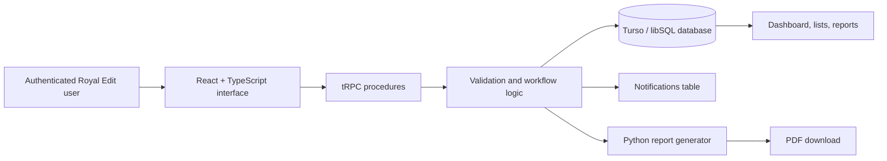

# Royal Edit Media House Operations Hub

**Prepared by:** Manus AI  
**Project type:** Internal project and team management web application  
**Version:** Prototype 1.0

## 1. What was built

The **Royal Edit Operations Hub** is a branded internal web application for organising the agency’s staff, client relationships, projects, task assignments, deadlines, notifications, and project-level reporting. It uses the user-owned Turso/libSQL database and SMTP sender configuration supplied for this deployment. The implementation is intended as a functional prototype for the Digital & Technology Lead assessment. It prioritises a coherent operational workflow rather than an oversized feature set.

The application is designed around one practical delivery sequence: a manager adds team members and clients, creates a project for a client, creates and assigns the tasks required to complete that project, updates statuses as work progresses, and generates a current project report when needed.

## 2. Problem solved

Creative and media teams often operate across fragmented messages, spreadsheets, and informal task tracking. That makes ownership difficult to see, deadlines easier to miss, and project progress harder to report. The Operations Hub creates one source of truth for essential delivery information.

| Operational problem | Prototype response |
|---|---|
| Team capacity is unclear | The Team module stores staff name, role, email, and active/inactive status. |
| Client context is disconnected from delivery work | The Clients module links every project to a client record and primary contact. |
| Project work has no consistent lifecycle | Projects have a client, description, delivery dates, and a controlled status set. |
| Task ownership may be unclear | Each task can be assigned or reassigned to a team member. |
| Assignments may be missed | An in-app notification is automatically created whenever a task is assigned or reassigned. |
| Reporting takes manual effort | The Reports module calculates delivery metrics and invokes a server-side Python/ReportLab generator for a downloadable PDF report. |

## 3. Implemented modules and workflows

| Module | Implemented capability |
|---|---|
| Executive dashboard | Shows total staff, total clients, active projects, overdue tasks, and the most recent operational activity. |
| Team members | Adds, edits, views, and deactivates staff through an active/inactive status. |
| Clients | Adds, edits, and views organisations with a primary contact, email, and phone number. |
| Projects | Creates, edits, views, and updates status inline for client-linked projects. |
| Tasks | Creates, edits, views, assigns, reassigns, and updates task status inline. |
| Notifications | Records assignment, reassignment, and administrator-facing task-progress notifications. Progress messages identify when work starts, becomes blocked, or is completed. |
| Reports | Calculates status counts, completion percentage, overdue items, and contributors for a selected project. |
| Python automation | Produces a branded PDF project report on demand. |
| Email delivery | Nodemailer sends assignment and reassignment emails directly to the assigned member’s stored email address. |

> **Notification design:** Every assignment and reassignment creates an in-app notification and attempts a Nodemailer email to the assigned team member’s stored email address. If SMTP is temporarily unavailable, the in-app notification remains recorded and the server logs the delivery failure.

## 4. System architecture

The frontend uses typed procedures rather than a manually maintained REST client. Each create or update action flows through server-side validation, then a database helper, before refreshing the relevant interface records. The system records activity entries for important events such as creating records, updating a status, or assigning a task. General-user task and notification queries scope through the authenticated `users.id` linked from `teamMembers.userId`; email remains contact data, not an authorization key.

The task-assignment workflow is automatic. When a task is created with an assignee, or when an existing task’s assignee changes, the server builds a notification message from the current task and project records, stores it against the assigned team member, and writes the corresponding activity item. When a General User changes an assigned task’s status, the server creates an administrator notification for every current Administrator. The message distinguishes started, blocked, completed, and returned-to-not-started states. Members can also send a separate **Almost done** update while a task is in progress; this alerts administrators without changing the task lifecycle status. Notification read actions carry a source discriminator so administrator and team-member notification IDs cannot collide.

## 5. Data model

| Table | Purpose | Key relationships |
|---|---|---|
| `teamMembers` | Staff directory, assignment recipients, and invitation status | Linked to `users`; referenced by `tasks` and `notifications` |
| `clients` | Client organisation and contact details | Referenced by `projects` |
| `projects` | Client delivery engagements | References `clients`; referenced by `tasks` |
| `tasks` | Individual actions and ownership | References `projects` and optionally `teamMembers` |
| `notifications` | In-app assignment and reassignment messages | References `teamMembers` and optionally `tasks` |
| `adminNotifications` | Administrator-facing task-progress messages | References `users` and optionally `tasks` |
| `activityLogs` | Recent operational events | Stores entity type, action, and a concise description |

## 6. Technology choices

| Layer | Technology | Reason for selection |
|---|---|---|
| Frontend | React 19, TypeScript, Tailwind CSS | Provides a responsive interface with strong type safety and fast component iteration. |
| UI system | Existing accessible component primitives with custom Royal Edit styling | Preserves keyboard-friendly interaction patterns while applying the brand system consistently. |
| Backend | Express and tRPC | Keeps client-server contracts typed end-to-end and reduces duplicated API definitions. |
| Database layer | Drizzle ORM with Turso/libSQL | Preserves the SQL relational model while moving persistence to the user-owned Turso database. |
| Authentication | Turso-backed email/password sessions with bcryptjs | Keeps credentials and session records in the user-owned Turso database without Manus OAuth. Team invitations link staff records to login accounts. |
| Automation | Python 3 + ReportLab invoked by the server | Creates branded PDF reports from structured project data. |
| Email delivery | Nodemailer over the supplied Gmail SMTP configuration | Sends assignment and reassignment messages directly to team-member email addresses. |
| Deployment runtime | Node 22 with Python 3 and ReportLab available in a Docker image | Allows the PDF generator to run in production as part of an on-demand request. |

## 7. Royal Edit brand implementation

The visual system was derived from the supplied **Royal Edit Media House Brand Kit**. The interface uses a deep black operating environment (`#080808`), primary gold (`#C9A84C`) for hierarchy and action, warm white (`#E8E0D0`) for high-contrast reading, muted gold (`#8B6F2E`) for secondary emphasis, and burnt orange (`#FF4D1C`) only for urgency and overdue states.

Cormorant Garamond is used for editorial display language, DM Sans supports body copy and controls, and Bebas Neue marks concise metadata and section labels. The navigation carries the supplied logo artwork, while thin ledger lines, production-grid motifs, and restrained gold accents reinforce the agency’s premium, cinematic direction.

## 8. How to run locally

The project uses the user-owned Turso database and standard email/password authentication. No OAuth provider is required, and no credentials should be committed to source control. Configure `TURSO_DATABASE_URL`, `TURSO_AUTH_TOKEN`, `JWT_SECRET`, and the SMTP variables used by Nodemailer (`SMTP_HOST`, `SMTP_PORT`, `SMTP_SECURE`, `SMTP_USER`, `SMTP_PASSWORD`, and `FROM_EMAIL`). The idempotent `pnpm db:push` command applies both the core schema and the invitation-account migration without dropping existing users or sessions.

| Command | Purpose |
|---|---|
| `pnpm dev` | Starts the local development server. |
| `pnpm check` | Runs the TypeScript compiler without emitting files. |
| `pnpm test` | Runs the automated unit tests. |
| `pnpm build` | Builds the production frontend and server bundle. |
| `pnpm db:push` | Applies the idempotent operational schema to the configured Turso database. |
| `python3 scripts/project_report.py` | Runs the PDF report generator, accepting JSON from standard input. |

### Authentication and administrator bootstrap

Registration creates a General User account by default. Passwords are hashed with bcryptjs before they are stored. Login creates a 30-day session record in Turso and sets an HTTP-only session cookie; active sessions are refreshed when they approach expiry, while expired sessions are deleted. The first administrator is created through the existing administrator bootstrap process. After that, only an Administrator should manage other user accounts.

When an Administrator adds a team member, the server creates the linked General User account with an unusable temporary password, creates a cryptographically random invitation token that expires after 48 hours, and sends a Nodemailer email containing a one-time `/setup-password` link. The invited member chooses their password through that route. On successful setup, the token is consumed, the team record is marked accepted and active, and a normal session is created immediately. Administrators can resend pending invitations. Duplicate emails are rejected so one person cannot accidentally receive disconnected team and login records. The server enforces the role and invitation state on every protected procedure; hiding interface controls is only an additional usability layer.

### Suggested product walkthrough

1. Sign in to the Operations Hub.
2. Add a staff member from **Team**.
3. Add a client organisation from **Clients**.
4. Create a linked project from **Projects**.
5. Add and assign a task from **Tasks**. The task owner receives an in-app notification and an assignment email automatically.
6. View the new message in **Inbox**.
7. Update a task or project status inline, then view the calculated results in **Reports**.
8. Select **Download project PDF** to run the server-side Python/ReportLab generator and download the report.

## 9. Validation and testing performed

The implementation includes a TypeScript check, a production build, unit tests, a functional test of the Python report generator, and desktop/mobile visual inspection.

| Check | Result |
|---|---|
| TypeScript validation | Passed with `pnpm check`. |
| Unit tests | Passed: 29 tests covering logout, invitation/password setup, input validation, permissions, Turso connectivity, task assignment and progress notification context, project-summary calculations, and PDF payload generation. |
| Turso read-only query | Passed against the supplied database URL and token. |
| Gmail SMTP transport | Nodemailer transport authentication passed without sending a test email. |
| Python PDF generation | Passed with a representative project payload and PDF assertion. |
| Production build | Passed with `pnpm build`. |
| Visual review | Dashboard, management modules, report workspace, inbox, and mobile overview were inspected in the browser. |

## 10. Challenges encountered

The main technical challenge was supporting a **server-side Python** report generator in a Node-based application. The application therefore includes a deployment Dockerfile that installs Python 3 alongside Node. The report task is request-scoped and light-weight, so it fits the prototype’s hosted runtime constraints without background workers.

Another design challenge was keeping the interface professional even when the database is empty. The solution uses intentional empty states and a guided onboarding sequence rather than artificial testimonials, fabricated reviews, or fake operational records.

## 11. Recommended next version

The prototype establishes the foundation for a larger internal platform. The next implementation cycle should introduce stronger operational controls and richer collaboration.

| Area | Recommended improvement |
|---|---|
| Authentication and access | Keep the two-role model: Administrator manages operational records and General User works only on assigned tasks. Add audit visibility for role changes and invitation resend/expiry events. |
| Email notifications | Add delivery retries, bounce handling, and provider monitoring around the current Nodemailer SMTP integration. |
| Per-person inbox | The current implementation restricts notification viewing to the linked authenticated user ID, while Administrators retain an oversight view. |
| Project detail pages | Add dedicated project and task detail routes with timelines, comments, attachments, and change history. |
| File handling | Store project briefs, deliverables, and approval files in object storage, saving only metadata in the database. |
| Reporting | Add scheduled weekly reports, report history, richer PDF layouts, and workload analytics. |
| Calendar integrations | Synchronise deadlines with a shared agency calendar. |
| Audit and protection | Add immutable audit events, record retention rules, rate limiting, structured backups, and field-level access policies. |
| Mobile application | Reuse the typed backend for a React Native/Expo mobile companion focused on assignments, notifications, and status updates. |

## 12. Data protection and security approach

The application uses authenticated access and server-side role validation for every operational procedure. Administrators manage team members, clients, projects, tasks, assignments, and reports. General users can view and update only their assigned tasks and notifications. A production rollout should also use least-privilege database access, encrypted connections, secure secret management, audit trails, backup and restoration policies, and explicit data retention controls.

The interface should never treat a display-only control as a security boundary. Every permission must be enforced again by the server before data is returned or changed.

## 12. Vercel deployment

The repository now includes a Vercel-compatible deployment layer without removing the existing Python reporting implementation. `api/[...path].ts` exposes the Express/tRPC backend as a serverless function, while `vercel.json` keeps `/api/*` requests on the backend and rewrites browser routes to the React entry document. The Python/ReportLab implementation remains canonical in `scripts/project_report.py`; `api/report.py` exposes that same script through a protected Python function when the application runs on Vercel. Local development continues to execute the script through the existing Python subprocess path.

Vercel must receive the private values `JWT_SECRET`, `TURSO_DATABASE_URL`, `TURSO_AUTH_TOKEN`, `SMTP_HOST`, `SMTP_PORT`, `SMTP_SECURE`, `SMTP_USER`, `SMTP_PASSWORD`, `FROM_EMAIL`, and a newly generated `REPORT_INTERNAL_SECRET`. `OWNER_NAME` and `OWNER_OPEN_ID` are not required by the current runtime. Vercel supplies `VERCEL` and `VERCEL_URL` automatically; the report bridge uses those values to call the protected Python function. The repository must not contain an `.env` file or credential values.

The Python function uses `requirements.txt` for Flask and ReportLab. The Vercel preview should be tested for login, invitation password setup, task progress notifications, assignment email, and PDF report download before production promotion.
